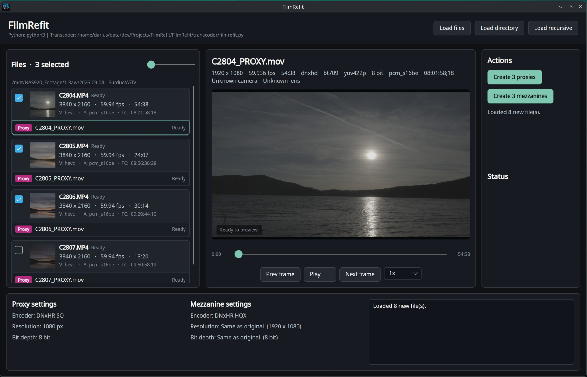

# FilmRefit

FilmRefit is a desktop transcoding tool for creating timecode-preserving proxies and mezzanine media for post-production workflows.

One of its main use cases is creating proxies quickly, using hardware acceleration where supported, for situations where your NLE cannot hardware-decode the original media, such as DaVinci Resolve on Linux or Kdenlive.



## Overview

FilmRefit prepares camera footage for post-production by creating editing-friendly proxy and mezzanine files while preserving source timecode.

The app can load individual files or directories, inspect clip metadata, show thumbnails and preview frames, and batch-create editing-friendly outputs next to the original media.

## Features

- Load files, directories, or recursive directory trees.
- Display clip metadata such as resolution, frame rate, duration, codec, pixel format, bit depth, audio codec, camera/lens metadata, and source timecode.
- Preview selected clips with play/pause, seeking, frame stepping, and playback-rate controls.
- Generate DNxHR SQ 1080p proxy files.
- Generate DNxHR HQX mezzanine files at source resolution and bit depth.
- Preserve source timecode.
- Show per-file batch progress, overall progress, ETA, success, and failure status.
- Install a DaVinci Resolve utility script that batch-links FilmRefit proxies in the Resolve media pool.

## DaVinci Resolve Proxy Linking

FilmRefit includes `FilmRefit Proxy Linker.lua`, a Resolve utility script that scans the current project's media pool and links existing proxies named next to their source clips.

The desktop app can install the script from **Settings -> DaVinci Resolve integration**. After installation, restart Resolve and run **Workspace -> Scripts -> FilmRefit Proxy Linker**.

The expected proxy naming convention is:

```text
Source: /path/to/Clip001.mov
Proxy:  /path/to/Clip001_PROXY.mov
```

The linker currently checks `mov`, `mp4`, and `mxf` proxy extensions with common uppercase variants. More details are in [resolve_importer/README.md](resolve_importer/README.md).

Generated outputs are written next to the source media:

- Proxy: `<source>_PROXY.mov`
- Mezzanine: `<source>_MEZZANINE.mov`

## Development

Build instructions, project structure, command-line usage, and architecture notes are in [docs/DEVELOPERS.md](docs/DEVELOPERS.md).

## Status

FilmRefit is early-stage software. The current focus is reliable proxy and mezzanine creation for post-production workflows.

## License

FilmRefit is licensed under the GNU General Public License v3.0. See [LICENSE](LICENSE).
